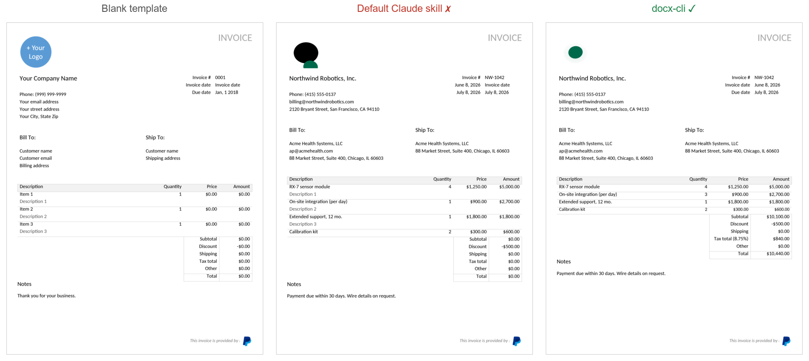
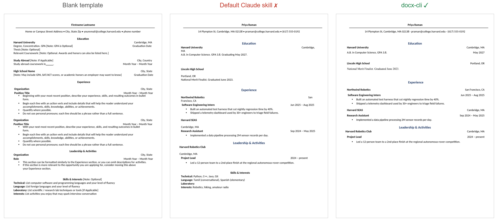
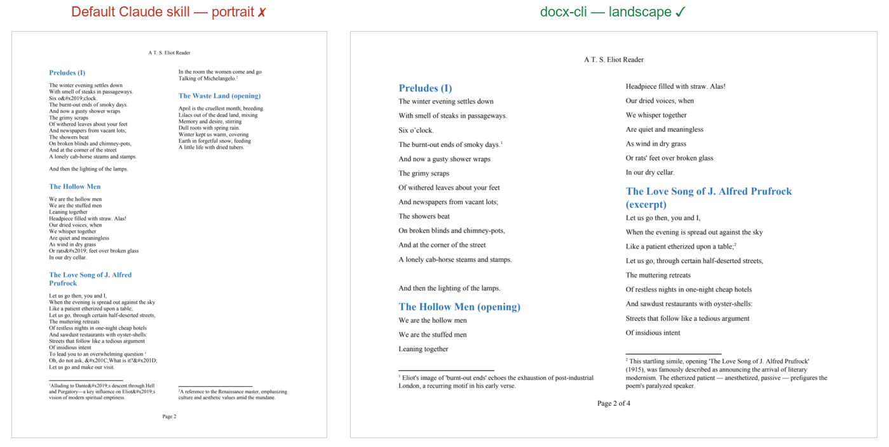

<p align="center">
  <a href="https://www.loom.com/share/da70269a970f42caa138fb3389b4b9cc">
    
  </a>
</p>

<p align="center"><em>Claude filling out and redlining an NDA with docx-cli — 60-second demo.</em></p>

## Why docx-cli?

1. The default Word/docx skill for Claude struggles to solve basic problems like redlining a contract, laying out a document, annotating a student's report, or filling out an invoice without a very strong model like Opus.
   - Haiku passes an average of 0.7/6 tests, with Sonnet passing 4/6 at best. Word couldn't even open its output 1/6 of the time.
   - `docx-cli` passes 4.3/6 tests with Haiku, and consistently passes 6/6 tests with Sonnet.
2. For that bad performance, it does so 1.7-2x more slowly and with 2-3x more tokens.
   - The default skill works by unwrapping the zip file that wraps a Word document and manually editing the XML inside. This takes a lot of thinking to read information from the doc and lots of tokens to write something correctly.
   - `docx-cli` works by providing the agent with standard commands to take actions, meaning they don't even have to try to understand the XML to edit. To read the data, the skill provides a heavily annotated markdown to make it easy for agents to understand the content.

## Examples

Three real tasks, rendered from the actual bake-off outputs — the default Claude skill's result next to docx-cli's (with the blank template too, where the task started from one).

### Fill an invoice



The default skill filled the line items but **mangled the logo into a black blob, left the "Description 1/2/3" placeholder lines in place, and zeroed every total — Subtotal and Total both read $0.00.** docx-cli filled it cleanly: a real logo, no leftover placeholders, and correct totals down to the **$10,440.00**.

### Restyle a résumé



Once the default skill shrank the margins, the right-hand location/date column **wrapped and broke — "San Francisco, CA" splits across two lines, "Cambridge, MA" splits, dates fall out of alignment.** docx-cli set the same margins and kept every line intact and right-aligned.

### Build a journal from scratch



The task **explicitly required landscape orientation** — "set the whole document to landscape so the wide page carries the two columns comfortably." The default skill ignored that instruction and built the journal in **portrait**, cramming the two columns onto a tall page. docx-cli set the page to landscape as asked, giving the verse a proper wide two-column spread with clean footnotes.

## Install

**As an agent skill** — the headline use. One `SKILL.md`, an [open standard](https://agentskills.io), that works across every harness that reads the format. The skill teaches the locator model and the redline / comment / fill workflows, then defers to `docx <command> --help` at runtime, so it can't go stale.

The quickest path works in any harness via [skills.sh](https://skills.sh) — it installs the skill into whichever agent you're using:

```sh
npx skills add kklimuk/docx-cli
```

Or use your harness's native install:

_Claude Code_ — one-line plugin install:

```
/plugin marketplace add kklimuk/docx-cli
/plugin install docx-cli@docx-cli
```

_Codex_ — add the marketplace (the plugin's skills auto-discover):

```
codex plugin marketplace add kklimuk/docx-cli
```

_Pi_ — one command, then invoke `/skill:docx-cli`:

```
pi install git:github.com/kklimuk/docx-cli
```

_Any other harness_ — drop [`skills/docx-cli/`](https://github.com/kklimuk/docx-cli/tree/main/skills/docx-cli) into your agent's skills directory (`~/.claude/skills/` or the cross-tool `~/.agents/skills/`). On first activation the skill's `bootstrap.sh` installs the `docx` binary and self-updates a stale one.

**As a standalone CLI** — the binary the skill drives, usable on its own:

```sh
curl -fsSL https://raw.githubusercontent.com/kklimuk/docx-cli/main/install.sh | sh
```

Or via npm (needs Bun ≥ 1.3): `bun add -g bun-docx`. Pre-built binaries ship for linux/macOS/Windows on x64 and arm64.

## Methodology

A controlled A/B bake-off. Both arms got the **same six real-world document tasks**, the **same starting files**, and the **same independent judge**, which graded every result from the **Word-rendered pages** against a per-task rubric — did the right values land, does it render, is the original formatting preserved, does it survive a re-read. Tokens and time were measured from the run transcripts, not self-reported.

To keep it fair, the default Claude skill got its **full intended toolset** — the `unpack`/`pack` scripts, `python-docx`, the Node `docx` library, and `pandoc` — verified working before every run. Each arm ran at two model tiers: **Haiku** (the weak, cheap model the tool is built for) and **Sonnet** (a strong model, to see whether the gap closes), with **three independent runs per arm per tier** — 12 runs, 72 task attempts.

The six tasks, each a thing a person would actually hand to an assistant:

| Task                    | What the agent had to do                                                                                                                        |
| ----------------------- | ----------------------------------------------------------------------------------------------------------------------------------------------- |
| **Fill an NDA**         | Fill 8 cover-page fields + both signature blocks of a Mutual NDA, remove the yellow highlight placeholders, keep the exact fonts.               |
| **Fill an invoice**     | Fill an invoice template, add line-item rows, fix the column widths, swap the logo, leave the footer intact.                                    |
| **Restyle a résumé**    | Give a résumé consistent navy headings, tighten the spacing, set half-inch margins — without breaking the layout or losing an embedded graphic. |
| **Redline a contract**  | Mark up four egregious clauses as tracked changes and pin review comments to the flagged terms.                                                 |
| **Finalize a contract** | Accept/reject a mix of existing tracked changes and reply-to / resolve the reviewer's comments.                                                 |
| **Author a journal**    | Build a multi-column, footnoted, hyperlinked poetry journal from scratch, with a figure and page numbers.                                       |

## Results

Three independent runs per arm at each tier; cells show the **mean** (range in parentheses).

|                           | Haiku (weak, cheap) |                       | Sonnet (strong) |                       |
| :------------------------ | ------------------: | --------------------: | --------------: | --------------------: |
|                           |        **docx-cli** |         default skill |    **docx-cli** |         default skill |
| Tasks solved (of 6)       |       **4.3** (4–5) |             0.7 (0–1) |   **6.0** (6–6) |             4.0 (4–4) |
| Rendered correctly (of 6) |                 5.7 |                   3.7 |             6.0 |                   4.7 |
| Outright-broken documents |               **0** |      ~1/run (up to 2) |           **0** |                     0 |
| Input tokens              |            **2.4M** |           6.1M (2.6×) |        **1.6M** |           3.6M (2.2×) |
| Wall-clock                |           **924 s** | 1,882 s (2.0× slower) |     **1,175 s** | 2,029 s (1.7× slower) |

<sub>Wall-clock = measured agent compute time (reconstructed from transcripts); the ratio is the comparable figure. Token/time ranges across the three runs never overlap between arms.</sub>

Three things hold across both tiers:

- **The correctness gap is widest where it matters most** — the cheap Haiku tier (~6×) — and a frontier model never closes it. The default skill **caps at 4/6**, losing the same two tasks every single Sonnet run (the contract redline and the résumé).
- **The cost and speed penalties are model-independent.** The default skill burns ~2.2–2.6× more tokens and runs **~1.7–2× slower** at _both_ tiers, with token/time ranges that never overlap — this isn't run-to-run noise.
- **Word couldn't reliably open the default Claude skill's work.** All 36 of docx-cli's outputs opened and rendered in Word on the first try. The default skill's hand-edited XML made Word choke: it failed to open **5 of 36** of its outputs, and a sixth of its review rounds had to fall back to LibreOffice. docx-cli never produced a file Word rejected.
